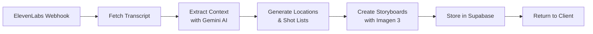

# AI Photography Assistant Director - Landing Page Content

## Hero Section

### Project Title
**PixieDirector*

### Tagline
*Plan your perfect photoshoot with voice-powered AI assistance*

### Short Description
An innovative AI-powered mobile app that transforms how photographers plan their shoots. Simply have a conversation with our AI assistant about your vision, and receive personalized location recommendations, detailed shot lists, and AI-generated storyboards - all optimized for Vancouver photographers.

### Call-to-Action Buttons
- Install PWA
- View on GitHub
- Try Demo

---

## Quick Access QR Codes

### GitHub Repository
```
[QR Code - Link to: https://github.com/[username]/hackathon2025]
```
*Scan to view source code*

### Install PWA
```
[QR Code - Link to: https://[production-url]]
```
*Scan on mobile to install app*

---

## How It Works - Pipeline Visualization

### The AI-Powered Workflow

```
┌─────────────────┐     ┌──────────────────┐     ┌─────────────────┐
│  Voice Input    │ --> │ AI Processing    │ --> │ Visual Output   │
│                 │     │                  │     │                 │
│ • Natural       │     │ • Context        │     │ • Location      │
│   conversation  │     │   extraction     │     │   scouting      │
│ • ElevenLabs    │     │ • Gemini 2.5     │     │ • Shot lists    │
│   voice AI      │     │ • Structured     │     │ • Storyboards   │
│                 │     │   output         │     │ • Imagen 3      │
└─────────────────┘     └──────────────────┘     └─────────────────┘
```

### Supabase Edge Function Pipeline



**Processing Stages:**
1. **Transcript Retrieval** - Fetch conversation from ElevenLabs API
2. **Context Extraction** - Parse 12 key fields using Gemini's structured output
3. **Location Generation** - Create 4-5 Vancouver-specific shooting locations
4. **Shot Planning** - Generate detailed shot lists with composition guidance
5. **Visual Storyboards** - Create black & white line-art previews with Imagen 3

---

## Technology Stack

### Frontend
- **Next.js 15.4** - Latest App Router architecture
- **React 19** - Cutting-edge UI components
- **TypeScript 5** - Type-safe development
- **Tailwind CSS v4** - Modern styling with PostCSS
- **PWA** - Installable mobile experience

### AI Services
- **ElevenLabs** - Natural voice conversations
- **Google Gemini 2.5 Flash** - Context understanding & planning
- **Google Imagen 3** - Storyboard visualization

### Backend & Infrastructure
- **Supabase Edge Functions** - Serverless Deno runtime
- **Supabase Storage** - Image hosting

---

## Key Features

### 🎙️ Voice-First Planning
Have natural conversations about your photoshoot vision. Our AI asks the right questions about locations, mood, subjects, and equipment.

### 📍 Smart Location Scouting
Get curated locations with:
- Exact addresses and directions
- Best shooting times & lighting
- Permit requirements
- Backup alternatives

### 📸 Detailed Shot Lists
Professional shot planning including:
- Composition & framing guides
- Subject posing directions
- Communication cues
- Technical camera settings

### 🎨 AI Storyboards
Visualize your shots before the shoot with:
- Black & white line-art previews
- Clear composition representation
- Easy-to-share visual references

### 📱 Mobile-First PWA
- Install as native app
- Share storyboards with clients
- Track shot completion


---

## Use Cases

### Portrait Photographers
Plan client sessions with location variety and pose ideas

### Wedding Photographers
Scout locations and create shot lists for the big day

### Commercial Shoots
Organize complex productions with detailed storyboards

### Photography Students
Learn composition and planning techniques


---

## Try It Now

1. **Install the PWA** on your mobile device
2. **Start a conversation** about your next photoshoot
3. **Get personalized recommendations** in under 60 seconds

---

## Development Team

Built with ❤️ for Hackathon 2025

*Empowering photographers with AI-powered planning tools*