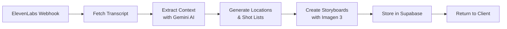

# AI Photography Assistant Director - Landing Page Content

## Hero Section

### Project Title
**PixieDirector*

### Tagline
*Plan your perfect photoshoot with voice-powered AI assistance*

### Short Description
An innovative AI-powered mobile app that transforms how photographers plan their shoots. Simply have a conversation with our AI assistant about your vision, and receive personalized location recommendations, detailed shot lists, and AI-generated storyboards - all optimized for Vancouver photographers.

### Call-to-Action Buttons
- Install PWA
- View on GitHub
- Try Demo

---

## Quick Access QR Codes

### GitHub Repository
```
[QR Code - Link to: https://github.com/[username]/hackathon2025]
```
*Scan to view source code*

### Install PWA
```
[QR Code - Link to: https://[production-url]]
```
*Scan on mobile to install app*

---

## How It Works - Pipeline Visualization

### The AI-Powered Workflow

```
┌─────────────────┐     ┌──────────────────┐     ┌─────────────────┐
│  Voice Input    │ --> │ AI Processing    │ --> │ Visual Output   │
│                 │     │                  │     │                 │
│ • Natural       │     │ • Context        │     │ • Location      │
│   conversation  │     │   extraction     │     │   scouting      │
│ • ElevenLabs    │     │ • Gemini 2.5     │     │ • Shot lists    │
│   voice AI      │     │ • Structured     │     │ • Storyboards   │
│                 │     │   output         │     │ • Imagen 3      │
└─────────────────┘     └──────────────────┘     └─────────────────┘
```

### Supabase Edge Function Pipeline



**Processing Stages:**
1. **Transcript Retrieval** - Fetch conversation from ElevenLabs API
2. **Context Extraction** - Parse 12 key fields using Gemini's structured output
3. **Location Generation** - Create 4-5 Vancouver-specific shooting locations
4. **Shot Planning** - Generate detailed shot lists with composition guidance
5. **Visual Storyboards** - Create black & white line-art previews with Imagen 3

---

## Detailed Generation Pipeline

### Stage 1: Voice Conversation & Transcript Retrieval
**Duration:** 30-60 seconds conversation + 2-5 seconds processing

The journey begins when a photographer initiates a conversation with our AI assistant powered by ElevenLabs. The AI engages in natural dialogue, asking contextual questions about:
- Shoot location preferences and constraints
- Time of day and duration
- Subject type (portraits, couples, families, etc.)
- Mood and aesthetic goals
- Equipment available
- Experience level

Once the conversation completes, the Supabase Edge Function receives a webhook notification and polls the ElevenLabs API to retrieve the full conversation transcript.

### Stage 2: Context Extraction with Gemini AI
**Duration:** 3-5 seconds | **Output:** Structured JSON with 12 key fields

Google Gemini 2.5 Flash processes the raw conversation transcript using a carefully crafted prompt with structured output schema. The AI extracts:

```json
{
  "location": "Vancouver area preference",
  "date": "Planned shoot date",
  "startTime": "Preferred start time",
  "duration": "Expected session length",
  "shootType": "Portrait/Wedding/Commercial/etc",
  "mood": "Aesthetic and emotional tone",
  "subject": "Who/what is being photographed",
  "equipment": ["Camera", "Lenses", "Lighting"],
  "experience": "Photographer skill level",
  "specialRequests": "Unique requirements",
  "weatherConsiderations": "Indoor/outdoor preferences",
  "mobilityConsiderations": "Accessibility needs"
}
```

The structured output ensures consistent, reliable data extraction regardless of conversation flow.

### Stage 3: Location Generation
**Duration:** 5-8 seconds | **Output:** 4-5 detailed location objects

Using the extracted context, Gemini generates location recommendations with Vancouver-specific knowledge. Each location includes:

```json
{
  "name": "Queen Elizabeth Park Rose Garden",
  "description": "Beautifully manicured rose garden with mountain views",
  "address": "4600 Cambie St, Vancouver, BC",
  "coordinates": { "lat": 49.2417, "lng": -123.1127 },
  "bestTime": "Golden hour (1 hour before sunset)",
  "lightingNotes": "Soft, diffused light through rose arbors",
  "accessibility": "Wheelchair accessible paths available",
  "permits": "No permits required for small shoots",
  "parkingInfo": "Free parking available on-site",
  "alternativeNearby": "VanDusen Botanical Garden (5 min drive)"
}
```

Locations are selected based on:
- Time of day optimization for lighting
- Weather/season considerations
- Accessibility requirements
- Permit regulations
- Travel time between locations

### Stage 4: Shot List Generation
**Duration:** 8-10 seconds | **Output:** 15-20 detailed shot specifications

For each location, Gemini creates specific shot recommendations:

```json
{
  "shotNumber": 1,
  "locationIndex": 0,
  "title": "Romantic Garden Portrait",
  "description": "Couple seated on ornate bench with roses",
  "composition": {
    "framing": "Medium shot, rule of thirds",
    "angle": "Slightly elevated, 45-degree angle",
    "foreground": "Soft rose blooms for depth",
    "background": "Blurred garden pathway"
  },
  "subjectDirection": {
    "positioning": "Seated close, angled toward each other",
    "expressions": "Natural smiles, looking at each other",
    "hands": "His arm around her, her hand on his knee"
  },
  "technicalSettings": {
    "aperture": "f/2.8 for background separation",
    "focalLength": "85mm for flattering compression",
    "iso": "400-800 depending on light"
  },
  "communicationCues": "Tell them to whisper a secret to each other",
  "alternativeOptions": "Try standing pose by rose arbor"
}
```

### Stage 5: Storyboard Visualization
**Duration:** 15-20 seconds | **Output:** Up to 6 storyboard images

Google Imagen 3 generates black and white line-art storyboards in parallel batches. The prompt engineering ensures:

```
Style: "Simple black and white line drawing, storyboard style"
Composition: Matches the shot specification exactly
Details: Clear subject positioning and framing
Format: 3:4 aspect ratio for mobile viewing
```

Images are generated with specific constraints:
- No complex textures or shading
- Clear composition guidelines
- Simplified but recognizable subjects
- Professional storyboard aesthetic

### Stage 6: Storage & Delivery
**Duration:** 2-3 seconds | **Output:** Complete session object

All generated content is assembled and stored:
1. Storyboard images uploaded to Supabase Storage with public URLs
2. Complete session data structured and returned to client
3. Data persisted in browser localStorage for offline access
4. Share links generated for client collaboration

### Error Handling & Fallbacks

The pipeline includes robust error handling:
- **Transcript Timeout:** Falls back to test conversation after 60 seconds
- **AI Generation Failures:** Retries with exponential backoff
- **Image Generation Limits:** Processes up to 6 images maximum
- **Partial Success:** Returns completed stages even if later stages fail

### Performance Optimization

- **Parallel Processing:** Image generation runs concurrently
- **Streaming Responses:** UI updates as each stage completes
- **Caching:** Conversation IDs prevent duplicate processing
- **Edge Computing:** Runs close to users via Supabase Edge Functions

---

## Technology Stack

### Frontend
- **Next.js 15.4** - Latest App Router architecture
- **React 19** - Cutting-edge UI components
- **TypeScript 5** - Type-safe development
- **Tailwind CSS v4** - Modern styling with PostCSS
- **PWA** - Installable mobile experience

### AI Services
- **ElevenLabs** - Natural voice conversations
- **Google Gemini 2.5 Flash** - Context understanding & planning
- **Google Imagen 3** - Storyboard visualization

### Backend & Infrastructure
- **Supabase Edge Functions** - Serverless Deno runtime
- **Supabase Storage** - Image hosting

---

## Key Features

### 🎙️ Voice-First Planning
Have natural conversations about your photoshoot vision. Our AI asks the right questions about locations, mood, subjects, and equipment.

### 📍 Smart Location Scouting
Get curated locations with:
- Exact addresses and directions
- Best shooting times & lighting
- Permit requirements
- Backup alternatives

### 📸 Detailed Shot Lists
Professional shot planning including:
- Composition & framing guides
- Subject posing directions
- Communication cues
- Technical camera settings

### 🎨 AI Storyboards
Visualize your shots before the shoot with:
- Black & white line-art previews
- Clear composition representation
- Easy-to-share visual references

### 📱 Mobile-First PWA
- Install as native app
- Share storyboards with clients
- Track shot completion


---

## Use Cases

### Portrait Photographers
Plan client sessions with location variety and pose ideas

### Wedding Photographers
Scout locations and create shot lists for the big day

### Commercial Shoots
Organize complex productions with detailed storyboards

### Photography Students
Learn composition and planning techniques


---

## Try It Now

1. **Install the PWA** on your mobile device
2. **Start a conversation** about your next photoshoot
3. **Get personalized recommendations** in under 60 seconds

---

## Development Team

Built with ❤️ for Hackathon 2025

*Empowering photographers with AI-powered planning tools*