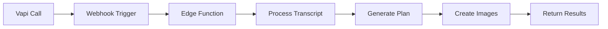

# Testing Guide

This comprehensive guide covers all testing capabilities for the Photo Assistant application, including test page usage, scripts, mock data patterns, and debugging techniques.

## Overview of Testing Capabilities

The Photo Assistant application provides a robust testing infrastructure that includes:

- **Interactive Test Page** (`/test-imagen`) - Web-based testing interface for all processing stages
- **Test Scripts** - Command-line tools for automated testing
- **Mock Data System** - Pre-configured test scenarios
- **Real-Time Testing** - Integration with actual Vapi conversations
- **Performance Monitoring** - Response time tracking and load testing

## Using the Test Page (/test-imagen)

### Purpose and Features

The test page provides a comprehensive interface for testing the entire photo session planning workflow without requiring actual voice conversations. It allows you to:

- Test different processing stages independently
- Toggle between mock and real data
- Simulate various conversation scenarios
- Monitor API responses and timing
- Debug edge function behavior

### Test Modes Explained

#### 1. Mock Data Testing
Use pre-configured test scenarios to simulate different conversation types:

```typescript
// Available mock scenarios:
- "Wedding Photoshoot" - Professional wedding session
- "Corporate Headshots" - Business photography
- "Family Portrait" - Casual family session
- "Product Photography" - E-commerce shoot
```

**When to use**: Initial development, UI testing, offline development

#### 2. Real Conversation ID Testing
Test with actual Vapi conversation data:

```
Example ID: conv_123456789
```

**When to use**: Debugging specific conversation issues, production verification

#### 3. Direct Transcript Testing
Input raw conversation transcripts directly:

```
Example format:
User: I need photos for my wedding next month
Assistant: I'd be happy to help plan your wedding photography...
```

**When to use**: Testing specific conversation patterns, edge cases

#### 4. Custom Context Testing
Provide additional context for more complex scenarios:

```json
{
  "location": "Central Park, NYC",
  "eventType": "wedding",
  "specialRequirements": "drone shots required"
}
```

**When to use**: Testing context-aware features, location-specific logic

### Processing Stage Options

The test page allows you to test each stage independently:

1. **Transcript Processing**
   - Tests conversation parsing
   - Validates transcript format
   - Checks for required information extraction

2. **Photo Planning**
   - Tests AI planning capabilities
   - Validates shot list generation
   - Checks timeline creation

3. **Image Generation**
   - Tests DALL-E integration
   - Validates prompt generation
   - Monitors image URL handling

4. **Full Pipeline**
   - End-to-end testing
   - Performance monitoring
   - Complete workflow validation

### Image Generation Toggle

Control whether to generate actual images:
- **ON**: Full integration test with DALL-E
- **OFF**: Faster testing, cost-effective, focuses on planning logic

## Test Scripts Usage

### test-webhook.sh - Basic Webhook Testing

**Purpose**: Validates webhook endpoint functionality and basic processing

**Usage**:
```bash
./scripts/test-webhook.sh
```

**Expected Output**:
```json
{
  "success": true,
  "conversationId": "test_12345",
  "processingTime": "2.3s"
}
```

**Common Use Cases**:
- Verifying webhook deployment
- Testing error handling
- Checking response format

### test-conversation.sh - Conversation Testing

**Purpose**: Tests complete conversation processing with mock or real data

**Usage**:
```bash
# With mock data
./scripts/test-conversation.sh

# With real conversation ID
./scripts/test-conversation.sh conv_123456789

# With custom transcript
./scripts/test-conversation.sh --transcript "path/to/transcript.txt"
```

**Expected Output**:
```json
{
  "success": true,
  "plan": {
    "shots": [...],
    "timeline": {...},
    "equipment": [...]
  },
  "images": [...]
}
```

### test-cors.sh - CORS Configuration Testing

**Purpose**: Validates CORS settings for cross-origin requests

**Usage**:
```bash
./scripts/test-cors.sh https://your-app-domain.com
```

**Expected Output**:
```
CORS Test Results:
✓ Access-Control-Allow-Origin: https://your-app-domain.com
✓ Access-Control-Allow-Methods: POST, OPTIONS
✓ Access-Control-Allow-Headers: Content-Type, Authorization
```

## End-to-End Testing Workflow

### 1. Testing Voice Conversations



**Steps**:
1. Initiate Vapi conversation
2. Monitor webhook logs
3. Track processing stages
4. Verify final output

### 2. Testing Edge Function Processing

**Local Testing**:
```bash
# Test with Supabase CLI
supabase functions serve process-conversation --env-file .env.local

# In another terminal
curl -X POST http://localhost:54321/functions/v1/process-conversation \
  -H "Content-Type: application/json" \
  -d '{"conversationId": "test_123"}'
```

**Production Testing**:
```bash
# Use test scripts or test page
./scripts/test-conversation.sh
```

### 3. Testing UI Components

**Component Testing Checklist**:
- [ ] Loading states display correctly
- [ ] Error states handle gracefully
- [ ] Success states show all data
- [ ] Responsive design works
- [ ] Accessibility features function

## Mock Data Patterns

### Available Mock Scenarios

```typescript
// Mock data structure
interface MockScenario {
  id: string;
  name: string;
  transcript: ConversationTranscript;
  expectedPlan: PhotoSessionPlan;
  testImages: string[];
}
```

### Creating Custom Mock Data

1. **Add to mock data file**:
```typescript
// src/lib/mock-data.ts
export const customScenario: MockScenario = {
  id: "custom_scenario_1",
  name: "Night Photography Session",
  transcript: {
    messages: [
      { role: "user", content: "I want to do night photography" },
      { role: "assistant", content: "Great! Let's plan a night session..." }
    ]
  },
  expectedPlan: {
    // ... plan details
  }
};
```

2. **Register in test page**:
```typescript
// app/test-imagen/components/TestModeSelector.tsx
const mockScenarios = [
  ...existingScenarios,
  customScenario
];
```

### When to Use Mocks vs Real Data

**Use Mocks When**:
- Developing new features
- Testing edge cases
- Running automated tests
- Working offline
- Avoiding API costs

**Use Real Data When**:
- Debugging production issues
- Testing integration points
- Validating actual user flows
- Performance benchmarking

## Debugging Techniques

### Console Logging Strategies

```typescript
// Structured logging approach
console.group('🔍 Processing Stage: Transcript');
console.log('Input:', transcript);
console.log('Parsed result:', parsedData);
console.log('Validation:', validationResult);
console.groupEnd();

// Performance logging
console.time('AI Processing');
const result = await processWithAI(data);
console.timeEnd('AI Processing');
```

### Network Request Inspection

**Browser DevTools**:
1. Open Network tab
2. Filter by "Fetch/XHR"
3. Look for `/api/test-imagen` requests
4. Inspect request/response payloads

**Edge Function Logs**:
```bash
# View real-time logs
supabase functions logs process-conversation --tail

# Filter by severity
supabase functions logs process-conversation --filter "level=error"
```

### Edge Function Logs

**Key log points to monitor**:
- Function invocation
- Transcript retrieval
- AI processing steps
- Image generation
- Error handling

```typescript
// Example log structure
{
  timestamp: "2025-01-16T10:30:00Z",
  level: "info",
  function: "process-conversation",
  stage: "planning",
  conversationId: "conv_123",
  duration: 1234,
  status: "success"
}
```

## Performance Testing

### Measuring Response Times

**Built-in Metrics**:
```typescript
// Test page shows timing for each stage
Processing Times:
- Transcript: 0.5s
- Planning: 2.1s
- Images: 3.4s
- Total: 6.0s
```

**Custom Performance Monitoring**:
```typescript
// Add to your test code
const metrics = {
  startTime: Date.now(),
  stages: {}
};

// Track each stage
metrics.stages.transcript = measureTime(() => processTranscript());
metrics.stages.planning = measureTime(() => generatePlan());
metrics.stages.images = measureTime(() => generateImages());

console.table(metrics.stages);
```

### Load Testing Considerations

**Basic Load Test**:
```bash
# Using Apache Bench
ab -n 100 -c 10 -T application/json \
   -p test-payload.json \
   https://your-domain.com/api/test-imagen

# Using curl in parallel
for i in {1..10}; do
  curl -X POST https://your-domain.com/api/test-imagen \
    -d @test-payload.json &
done
```

**Monitoring During Load Tests**:
- Edge function invocation count
- Response time percentiles
- Error rates
- Rate limiting behavior

## CI/CD Considerations

### Automated Testing Setup

```yaml
# .github/workflows/test.yml
name: Test Suite
on: [push, pull_request]

jobs:
  test:
    runs-on: ubuntu-latest
    steps:
      - uses: actions/checkout@v3
      
      - name: Setup Node
        uses: actions/setup-node@v3
        with:
          node-version: '20'
          
      - name: Install dependencies
        run: npm ci
        
      - name: Run linter
        run: npm run lint
        
      - name: Run type checks
        run: npm run type-check
        
      - name: Run integration tests
        run: |
          ./scripts/test-webhook.sh
          ./scripts/test-conversation.sh
```

### Environment-Specific Testing

**Development**:
- Use mock data extensively
- Focus on rapid iteration
- Local edge function testing

**Staging**:
- Mix of mock and real data
- Full integration testing
- Performance benchmarking

**Production**:
- Minimal testing (monitoring only)
- Real data validation
- Error tracking

### Test Data Management

```bash
# Separate test configurations
.env.test          # Test environment variables
.env.staging       # Staging configuration
.env.production    # Production settings

# Test data fixtures
/tests/fixtures/
  - conversations/
  - plans/
  - images/
```

## Best Practices

1. **Always test error paths** - Ensure graceful degradation
2. **Use appropriate test data** - Match production scenarios
3. **Monitor performance** - Track regression over time
4. **Document test cases** - Maintain test scenario catalog
5. **Automate repetitive tests** - Use scripts for regression testing
6. **Test across environments** - Verify staging matches production
7. **Keep tests maintainable** - Update as features evolve

## Troubleshooting Common Issues

### Webhook Not Responding
- Check CORS configuration
- Verify environment variables
- Confirm edge function deployment

### Image Generation Failing
- Validate API keys
- Check rate limits
- Verify prompt format

### Slow Performance
- Review AI model usage
- Optimize prompt length
- Consider caching strategies

### Test Data Inconsistencies
- Sync mock data with schema
- Validate test fixtures
- Update after API changes