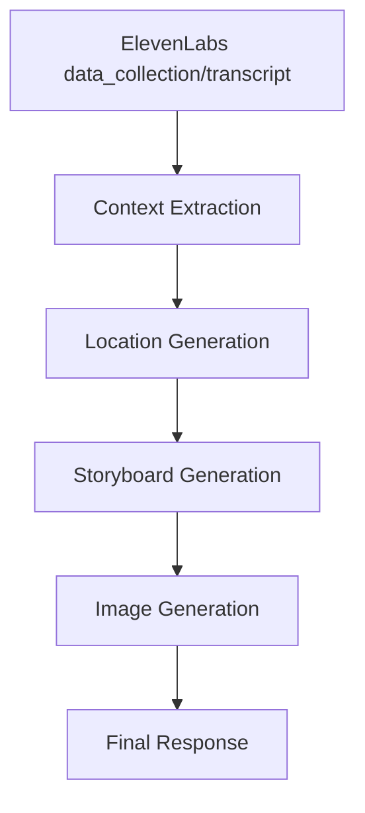

# ElevenLabs Webhook Prompt Pipeline Documentation

This document outlines the prompt structure and data flow through the ElevenLabs webhook pipeline.

## Pipeline Overview



## Stage 1: Context Extraction

### Input Sources

1. **Primary: data_collection** (from ElevenLabs agent)
```json
{
  "location": "San Francisco",
  "date": "2025-01-27",
  "startTime": "16:30",
  "duration": "2 hours",
  "shootType": "engagement",
  "mood": "romantic, candid",
  "primarySubjects": "Sarah and John, couple, 2",
  "secondarySubjects": "golden retriever named Max",
  "locationPreference": "itinerary",
  "mustHaveShots": "Golden Gate Bridge; beach sunset",
  "specialRequirements": "Dog-friendly locations",
  "experience": "intermediate"
}
```

2. **Fallback: transcript** (raw conversation text)
```text
"I want to do a sunset engagement shoot in San Francisco with my partner and our dog..."
```

### Processing

**For data_collection**: Direct mapping with minimal transformation
- Combines primarySubjects + secondarySubjects → subject
- Parses mood from comma-separated string to array
- Merges specialRequirements + mustHaveShots → specialRequests

**For transcript**: AI extraction using this prompt:
```
Extract photography shoot details from this conversation transcript.

Return ONLY a JSON object with these exact fields:
{
  "shootType": "type of photography (e.g., portrait, wedding, lifestyle, branding, etc.)",
  "mood": ["array of 2-3 mood/style descriptors"],
  "timeOfDay": "preferred lighting time or 'flexible'",
  "subject": "description of what/who is being photographed",
  "duration": "estimated shoot duration",
  "equipment": ["optional: mentioned camera gear"],
  "experience": "photographer's skill level",
  "specialRequests": "any specific requirements mentioned",
  "location": "city or venue mentioned",
  "locationPreference": "how locations should be arranged (clustered, spread out, etc.)"
}

Be creative and specific with shootType and mood based on the conversation context.
```

### Output: PhotoShootContext
```typescript
{
  shootType: string,              // "engagement"
  mood: string[],                 // ["romantic", "candid", "natural"]
  timeOfDay: string,              // "flexible"
  subject: string,                // "Sarah and John, couple, 2, golden retriever named Max"
  duration: string,               // "2 hours"
  equipment?: string[],           // []
  experience: string,             // "intermediate"
  specialRequests?: string,       // "Dog-friendly locations. Must include: Golden Gate Bridge; beach sunset"
  location?: string,              // "San Francisco"
  date?: string,                  // "2025-01-27"
  startTime?: string,             // "16:30"
  locationPreference?: string     // "itinerary"
}
```

## Stage 2: Location Generation

### Input
- PhotoShootContext from Stage 1

### Prompt
```
You are an expert location scout for photography. Find unique, beautiful, and practical photo spots.

Location: ${location}
Shoot type: ${shootType}
Mood/aesthetic: ${mood.join(', ')}
Date: ${date}
Start time: ${startTime}
Duration: ${duration}
Subjects: ${subject}
Special requirements: ${specialRequests}

Create [4-5 spots within walking distance OR 4-5 locations forming a logical route].

Return ONLY a JSON array of locations with these exact fields:
[
  {
    "name": "Specific location name",
    "address": "Address or directions to get there",
    "description": "Visual description focusing on what makes this spot special for [mood] photography",
    "bestTime": "Optimal time considering the [startTime] start and lighting",
    "lightingNotes": "How natural light works here and any lighting tips",
    "accessibility": "Parking, public transit, walking requirements",
    "permits": "Any permit requirements or restrictions",
    "alternatives": ["1-2 nearby backup spots if this location is unavailable"]
  }
]
```

### Output: Location[]
```json
[
  {
    "name": "Baker Beach - North End",
    "address": "Gibson Rd & Battery Chamberlin Rd, San Francisco",
    "description": "Dramatic beach setting with Golden Gate Bridge views, perfect for romantic sunset shots with crashing waves and golden sand",
    "bestTime": "4:30 PM - 6:30 PM for golden hour with bridge backdrop",
    "lightingNotes": "Sun sets behind the bridge creating stunning backlight. Bring reflector for fill light on faces",
    "accessibility": "Free parking lot, 5-minute walk to beach. Some areas rocky",
    "permits": "No permits for small groups. Keep 25ft from wildlife",
    "alternatives": ["Marshall's Beach", "Lands End Lookout"]
  },
  // ... 3-4 more locations
]
```

## Stage 3: Storyboard Generation

### Input
- PhotoShootContext from Stage 1
- Location[] from Stage 2

### Prompt
```
You are an expert photographer and creative director. Create a detailed shot list for this photography session.

Context:
- Location: ${location}
- Shoot type: ${shootType}
- Mood: ${mood.join(', ')}
- Subjects: ${subject}
- Duration: ${duration}
- Special requirements: ${specialRequests}

Locations (${locations.length}):
1. Baker Beach - North End - Best at 4:30 PM - 6:30 PM
2. Palace of Fine Arts - Best at 3:00 PM - 4:00 PM
[etc...]

Create [6-8] diverse shots distributed across all locations.

Return ONLY a JSON array where each shot has these exact fields:
[
  {
    "locationIndex": 0,
    "shotNumber": 1,
    "title": "Descriptive name for this shot",
    "imagePrompt": "Visual description for storyboard (30 words, artistic style)",
    "composition": "Full details: framing (wide/medium/close), subject positioning, poses, and environment use",
    "direction": "Exact words to direct subjects (e.g., 'Look at each other and laugh like you just shared a secret')",
    "technical": "Camera settings (aperture, shutter, ISO), lens choice, and lighting approach",
    "equipment": ["Required gear list"]
  }
]
```

### Output: Shot[]
```json
[
  {
    "locationIndex": 0,
    "shotNumber": 1,
    "title": "Golden Gate Sunset Embrace",
    "imagePrompt": "Couple silhouetted against golden sunset with Golden Gate Bridge, dog sitting beside them, waves crashing on beach, romantic atmosphere",
    "composition": "Wide shot, rule of thirds with couple on left third, bridge in background right. Couple standing close, foreheads touching, dog sitting at their feet looking toward camera",
    "direction": "Sarah, rest your head on John's shoulder and both look out at the bridge. Max, sit! Good boy, stay right there.",
    "technical": "24-70mm at 35mm, f/5.6 for sharp couple and bridge, 1/250s, ISO 200. Expose for sky, use reflector for couple",
    "equipment": ["24-70mm lens", "5-in-1 reflector", "ND filter if needed"]
  },
  // ... 5-7 more shots
]
```

## Stage 4: Image Generation (Optional)

### Input
- Shot[] from Stage 3
- Context mood for styling
- generateImages flag and imageCount from request

### Prompt (for each selected shot)
```
Professional photography storyboard illustration: ${shot.imagePrompt}. 
Style: Clean sketch/illustration style, ${mood.join(', ')} mood.
Show camera angle and composition clearly.
```

### Output
- Base64 encoded JPEG images attached to shot objects
- 16:9 aspect ratio
- Clean storyboard visualization style

## Final Response Structure

```json
{
  "success": true,
  "conversationId": "conv_test123",
  "timestamp": "2025-01-16T10:30:45Z",
  "context": {
    // PhotoShootContext object
  },
  "locations": [
    // Array of Location objects
  ],
  "shots": [
    // Array of Shot objects with optional storyboardImage field
  ]
}
```

## Data Flow Summary

1. **ElevenLabs** → Structured data_collection or transcript
2. **Context Extraction** → Normalized PhotoShootContext
3. **Location Generation** → Array of specific, actionable locations
4. **Storyboard Generation** → Detailed shot list with all information needed
5. **Image Generation** → Visual storyboards for key shots
6. **Response** → Complete photography session plan

Each stage builds upon the previous one, with the LLM having access to all context from earlier stages to create increasingly specific and actionable outputs.